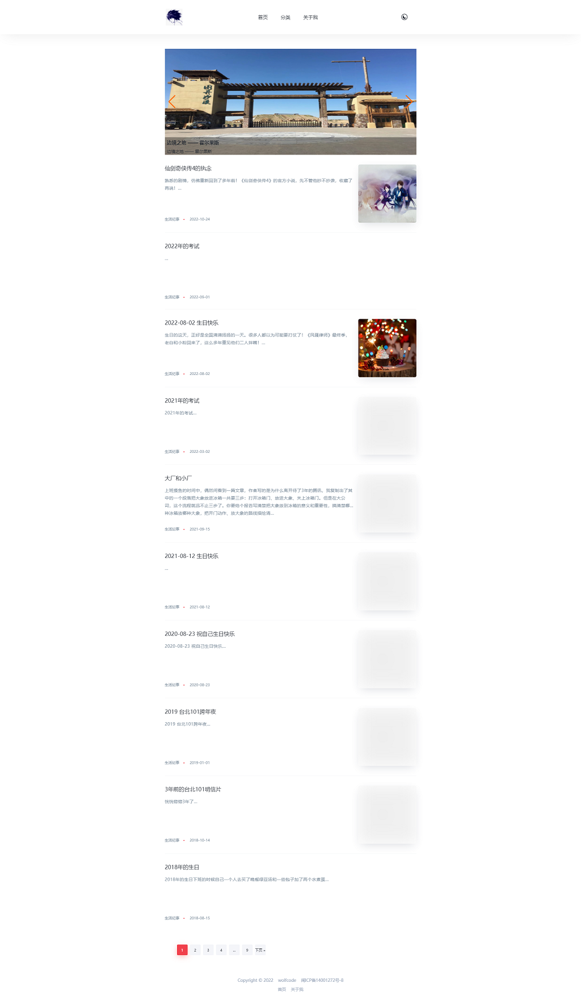

<h1 align="center">
    <a href="https://www.wolfcode.net/info/239/" target="_blank">
         <code>wolfcode-blog</code> 基于 <code>webman</code> 开源博客程序
    </a>
</h1>

[](https://www.wolfcode.net)
[](https://github.com/wolf-leo/webman-blog/commits/main)
[](https://github.com/wolf-leo/webman-blog)

## 程序简介

- 🔧 依赖 `webman` 搭建【 需要 php>=7.4，建议 `php8.1` | MySQL>=5.7，建议 `MySQL8.0` 】
- 📄 `webman` 官方文档地址：[https://www.workerman.net/doc/webman/](https://www.workerman.net/doc/webman/)
- 💙 程序默认关闭 `app_debug` ，如需调试，请自行前往根目录中的 `.env` 文件配置
- ⭐ 程序默认静默安装数据库，默认数据库名 `my_blog_2022`
- 🤗  __默认启用 `template_002` 模板，可在 `.env` 文件中配置 `DEFAULT_TEMPLATE` 【目前可选 `template_001` `template_002` 】__

## 配置说明

- 安装前请先配置根目录下的 `.env` 文件相关信息
    - 主要修改 `DB_USERNAME` （数据库用户） 和 `DB_PASSWORD` （数据库密码） 两个参数值
    - 程序默认数据库名 `my_blog_2022` 如果不喜欢，可修改 `DB_DATABASE` 参数值
    - 程序默认端口 `8787`，如果不喜欢，可修改 `APP_PORT` 参数值

## 样式参考

<center>

</center>

## 如何运行

- 将代码 `下载` 或者 `git clone` 到本地，放入到预设路径（例如 `/www/wwwroot/yourpath`下）
    - 在 `/www/wwwroot/yourpath` 下运行 `php start.php start -d`
- 运行前请先确认php版本，可以运行 `php -v` 查看

- 相关命令的区别

> `debug` 方式运行 【 调试模式 | 用于开发调试 】
>
> > ```php start.php start```
>
> `daemon` 方式运行 【 守护模式 | 用于正式环境 】
>
> > ```php start.php start -d```
>
> `restart` 服务重启 【 该命令相当于先 stop 后 start 】
>
> > ```php start.php restart```    # 重启后进入调试模式
>
>> ```php start.php restart -d``` # 重启后进入守护模式
>
> `reload` 代码重载 【 该命令不会中断当前服务 】
>
> > ```php start.php rload```

- 启动后访问 `http://127.0.0.1:8787` 即可，其中端口号跟 `APP_PORT` 参数值相同
- 如需外网访问，搭配 `Nginx` 进行反向代理即可
- **切换默认模板后没有效果，可以用 `php start.php start -d` 重启项目**

```
server {

    server_name 站点域名;
    listen 80;
    root /your_blog_path/public;

    location / {
    
        proxy_set_header X-Real-IP $remote_addr;
        proxy_set_header Host $host;
        
        if (!-f $request_filename){
            proxy_pass http://127.0.0.1:8787;   # 端口 8787 必须跟 APP_PORT 参数值一致
        }
        
    }
    
}
  ```

- 配置后访问 `http://你的域名/` 即可
- 后台地址，在主访问域名后面+ `/admin` 即可，例如 `http://你的域名/admin` ，后台账号 `admin` 密码 `123456`
- ### 特别提醒
    - **尽量不要在 `Windows` 系统下运行该程序，建议使用 `Linux` 环境运行**
    - **程序底层已做好 `php8+` 兼容，请谨慎使用全局的 `composer update`**
    - **不做向下版本兼容，如需要其他版本，请自行兼容开发**
    - **如果出现 PHP Fatal error:  Uncaught Error: Call to undefined function pcntl_signal()，请到 `php.ini` 配置文件中删除对应禁用函数即可，或者宝塔用户可在 php版本管理的 `禁用函数` 中自行删除**

### 第三方引用

- [webman](https://www.workerman.net/doc/webman/)
- [think](https://github.com/top-think) (orm、cache、template)
- [oss](https://github.com/aliyun/aliyun-oss-php-sdk) (阿里云存储)
- [cos](https://github.com/tencentyun/cos-php-sdk-v5) (腾讯云存储)
- [layui](https://layui.js.cn/)
- [layuimini](http://layuimini.99php.cn/docs/)
- [sdeditor](https://www.sdcms.cn/editor/) (编辑器)

## LICENSE

- MIT
